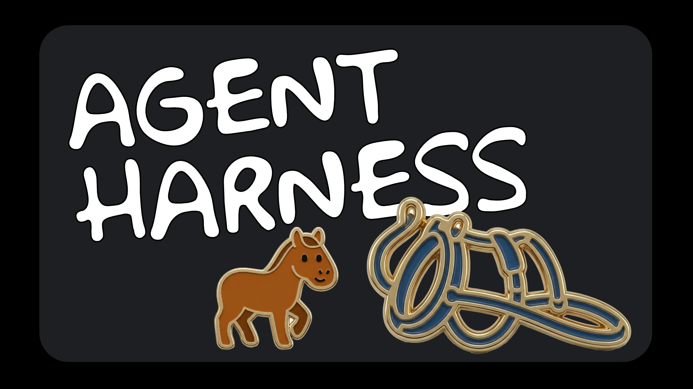

# Agent Harness

A Claude Code toolkit implementing **harness engineering** principles to automate developer tasks through structured execution and persistent agent memory.



## What is Harness Engineering?

This toolkit shifts the focus from writing code to **designing environments that enable AI agents to do reliable work**. The harness (constraints, feedback loops, documentation, rules) is what makes agents effective.

### Four Pillars

| Pillar | Implementation |
|--------|----------------|
| **Structured Execution** | All workflows follow Research → Plan → Execute → Verify (R→P→E→V) |
| **Agent Specialization** | 8 agents with scoped tools and rules |
| **Persistent Memory** | Filesystem-backed memory per agent for decisions and patterns |

---

## Quick Start

### 1. Install

```bash
npm install -g @tonycasey/agent-harness
```

### 2. Initialize in Your Project

```bash
cd /path/to/your/project
ah init
```

This creates `.claude/` with skills, workflows, agents, rules, and templates.

### 3. Run Claude

```bash
claude
```

Commands are available immediately via `/ah`.

> **Note:** All `/ah` commands below are run **inside Claude CLI**, not in your regular terminal. Start Claude with `claude`, then type the commands.

---

## Step-by-Step Usage Guide

> **These commands are typed in Claude CLI, not your terminal.**

### Starting a New Feature

```bash
# 1. Plan the feature (creates .claude/plans/user-auth.md)
/ah plan user-authentication

# 2. Break into tasks (creates execution plan)
/ah plan split .claude/plans/user-auth.md

# 3. Create tickets from tasks
/ah plan tickets .claude/plans/user-auth-execution-plan.md

# 4. Start the first task
/ah git checkout PROJ-1234

# 5. Develop with strict architecture rules
/ah develop
# Enforces: clean-architecture, testing-principles, coding-standards

# 6. When ready for PR
/ah pr-ready      # Validates tests, lint, coverage
/ah pr create     # Creates draft PR

# 7. Watch for review comments
/ah pr watch 123  # Auto-fixes and resolves comments
```

### Fixing a Bug

```bash
# 1. Create fix branch from ticket
/ah git checkout PROJ-5678

# 2. Investigate and fix
/ah bug-fix "login fails on mobile"
# This follows R→P→E→V:
# - Research: reproduce issue, identify affected code
# - Plan: design fix approach
# - Execute: write failing test, implement fix
# - Verify: run tests, save evidence

# 3. Commit with AI metadata
/ah git commit
# Automatically adds AI-Decision, AI-Context trailers

# 4. Create PR
/ah pr create "Fix mobile login"
```

### Reviewing a PR

```bash
# Fast online review (no local setup)
/ah pr review web-app 445

# Submit after reviewing comments
/ah pr review-submit web-app 445
```

### Managing Knowledge Across Repos

```bash
# Generate summary of current repo
/ah knowledge scan
# Creates .claude/knowledge/self.md

# Import summary from another repo
/ah knowledge import ~/code/api-server

# Search across all known repos
/ah knowledge search "authentication"
```

### Remembering Decisions

```bash
# Store a decision in git memory
/ah git remember "chose JWT over sessions for stateless scaling"

# Search past decisions
/ah git recall "authentication"
```

---

## How Workflows Execute (R→P→E→V)

Every workflow follows a structured four-phase pattern:

```
┌─────────────────────────────────────────────────────────┐
│ Phase 1: RESEARCH                                       │
│   - Load agent memory                                   │
│   - Gather context before taking action                 │
│   - Identify risks or blockers                          │
│   Output: Understanding of current state                │
└─────────────────────────────────────────────────────────┘
                         ↓
┌─────────────────────────────────────────────────────────┐
│ Phase 2: PLAN                                           │
│   - Outline approach before executing                   │
│   - Confirm with user if ambiguous                      │
│   Output: Clear action plan                             │
└─────────────────────────────────────────────────────────┘
                         ↓
┌─────────────────────────────────────────────────────────┐
│ Phase 3: EXECUTE                                        │
│   - Follow the plan                                     │
│   - Make incremental progress                           │
│   Output: Completed work artifacts                      │
└─────────────────────────────────────────────────────────┘
                         ↓
┌─────────────────────────────────────────────────────────┐
│ Phase 4: VERIFY                                         │
│   - Validate results meet requirements                  │
│   - Save evidence to .tmp/evidence/                     │
│   - Record decisions to agent memory                    │
│   Output: Verification report with evidence             │
└─────────────────────────────────────────────────────────┘
```

---

## Agent Memory

Agents persist decisions and patterns to `.claude/memory/<agent>.json`:

```json
{
  "agent": "developer",
  "decisions": [
    {
      "date": "2026-03-15",
      "context": "Choosing auth strategy",
      "decision": "Use JWT with refresh tokens",
      "rationale": "Stateless, works with microservices"
    }
  ],
  "patterns": [
    {
      "name": "API error handling",
      "description": "All routes wrap in try-catch with standard response"
    }
  ]
}
```

Memory is consulted in Phase 1 (Research) and updated in Phase 4 (Verify).

---

## Evidence Collection

Workflows save evidence to `.tmp/evidence/<workflow>/`:

| Workflow | Evidence |
|----------|----------|
| `bug-fix` | Failing test, passing test, full suite output |
| `refactor` | Before snapshot, after snapshot, diff, test output |
| `pr-create` | PR metadata, test results, lint results |
| `pr-review` | Review summary, issues found |

Evidence provides proof of work completion and aids debugging.

---

## Commands Reference

> **Run these inside Claude CLI** (start with `claude` in your terminal)

### Git (with AI Metadata)
```
/ah git checkout <branch>       # Checkout or create branch
/ah git commit [message]        # Commit with AI trailers
/ah git push                    # Push to remote
/ah git status                  # Detailed status
/ah git remember <decision>     # Store decision in git memory
/ah git recall [query]          # Search past decisions
```

### Pull Requests
```bash
/ah pr create [title]           # Create draft PR with checks
/ah pr watch <number>           # Auto-fix comments, resolve feedback
/ah pr stop <number>            # Stop watching
/ah pr review <repo> <pr>       # Online review (fast)
/ah pr review-local <repo> <pr> # Local review (full)
/ah pr review-submit <repo> <pr># Submit pending review
```

### Tickets (Jira, Linear, ClickUp, GitHub Issues)
```bash
/ah ticket create <title>       # Create ticket
/ah ticket view <id>            # View details
/ah ticket transition <id> <s>  # Change status
/ah ticket ship <id>            # One command to take a ticket through all stages to PR
```

### Planning
```bash
/ah plan <feature>              # Document feature plan
/ah plan split <path>           # Break into tasks
/ah plan tickets <path>         # Create tickets from tasks
```

### Knowledge Base
```bash
/ah knowledge scan              # Generate repo summary
/ah knowledge import <path>     # Import from another repo
/ah knowledge search <query>    # Search across repos
```

### Development
```bash
/ah develop [plan-path]         # Execute tasks (enforces architecture rules)
/ah new-feature <name>          # Start feature with TDD
/ah bug-fix <issue>             # Systematic bug fix
/ah pr-ready                    # Validate before PR
/ah refactor <target>           # Safe refactoring
/ah test <repo> [file]          # Run Playwright tests
/ah automate <task>             # Create automation script
```

---

## Architecture

```
User Command → Skill → Workflow → Agent → Rules/Templates → Output
                                    ↓
                              Agent Memory
```

| Component | Location | Purpose |
|-----------|----------|---------|
| **Skill** | `.claude/skills/ah/` | Entry point, routes commands |
| **Workflow** | `.claude/workflows/` | R→P→E→V step sequences |
| **Agent** | `.claude/agents/` | Executor with tools and rules |
| **Rule** | `.claude/rules/` | Constraints (formats, standards) |
| **Template** | `.claude/templates/` | Artifact templates |
| **Memory** | `.claude/memory/` | Persistent agent memory |

---

## Project Structure (after `ah init`)

```
.claude/
  skills/ah/                 # Command router
  workflows/                 # 27 R→P→E→V workflows
  agents/                    # 8 specialized agents
  rules/                     # Format constraints
    shared/                  # Clean architecture, testing principles
    typescript/              # TypeScript standards
  templates/                 # PR, commit, review templates
  memory/                    # Agent memory files
  tools/                     # External tool docs
  knowledge/                 # Cross-repo knowledge base
  hooks.json                 # Event automation
  .tmp/evidence/             # Execution evidence (gitignored)
```

---

## Requirements

- Node.js >= 18.0.0
- Claude Code CLI
- GitHub CLI (`gh`) for PR operations
- Project tool CLI (Jira, Linear, ClickUp, or GitHub)

---

## Terminal Commands

These are run in your **regular terminal** (not Claude CLI):

```bash
ah init          # Set up toolkit in .claude/
ah status        # Check installation
ah uninstall     # Remove toolkit files
ah help          # Show help
```

---

## License

MIT
